# RejseplanAPI — Smart Commuter Dashboard

A self-hosted real-time departure board and Home Assistant integration powered by Rejseplanen API 2.0 — built for daily commuters who want live train data on their wall display and smart home automations that actually know when to tell them to leave.

## Features

- **Real-time departure boards** — polls Rejseplanen every 30 seconds (configurable), pushes updates to all connected browsers over WebSocket
- **Multi-stop support** — watch Odense, Nyborg, and any other stop simultaneously; switch between them with a single click
- **"Go Now" alert** — full-screen overlay fires when minutes-to-departure equals your configured walk time; never miss a train because you lost track of time
- **Cancellation detection** — cancelled departures are flagged immediately, before Rejseplanen removes them from the board
- **Delay compensation log** — automatically records every delay >= 30 minutes to a local SQLite database; query it later to support DSB refund claims
- **Train-only mode** — optional filter that hides buses, metro, and ferries so your commuter dashboard stays clean
- **Service disruption panel** — live HIM (Hafas Information Manager) alerts from Rejseplanen; dismissable per session
- **Home Assistant integration** — native custom component with three sensors (`next_departure`, `delay_minutes`, `minutes_until`) and two binary sensors (`go_now`, `cancelled`) per stop/line combo
- **Flip-digit clock** — animated departure board-style wall clock built into the frontend
- **Docker-first deployment** — three-container stack (FastAPI backend, SvelteKit frontend, nginx), one `docker-compose up -d` away
- **Interactive API docs** — FastAPI auto-generates Swagger UI at `/docs` and ReDoc at `/redoc`

## Screenshots

> Add screenshots after first deployment — suggested shots:
> - Full dashboard view with departure board and flip clock
> - "Go Now" overlay in action
> - Service disruption panel open
> - Home Assistant device card showing all five entities

## Architecture

```mermaid
flowchart TD
    Browser["Browser\n(SvelteKit)"]
    HA["Home Assistant\n(custom component)"]
    nginx["nginx\n:80"]
    frontend["frontend\nSvelteKit :3000"]
    backend["backend\nFastAPI :8000"]
    rejseplanen["Rejseplanen API 2.0\nxmlopen.rejseplanen.dk"]
    sqlite[("SQLite\ndelay_log.db")]

    Browser -->|"HTTP / WS"| nginx
    nginx -->|"/ routes"| frontend
    nginx -->|"/api/* routes"| backend
    nginx -->|"WS /ws"| backend

    HA -->|"GET /api/departures/{stop_id}\nevery 30 s"| backend

    backend <-->|"HTTPS — departureBoard\nlocationSearch, himSearch\n(poll every 30 s)"| rejseplanen
    backend <-->|"delay_minutes >= 30"| sqlite

    backend -->|"WebSocket broadcast\non every poll"| Browser

    style rejseplanen stroke-dasharray: 5 5
    style sqlite fill:#1a2a1a
```



## Quick Start

```bash
# 1. Clone
git clone https://github.com/jonaslarsen0/dograllyblazorserver.git rejseplanapi
cd rejseplanapi

# 2. Configure
cp .env.example .env
# Edit .env — add your REJSEPLANEN_API_KEY and set DEFAULT_STOP_IDS

# 3. Build and start
docker compose up -d --build

# 4. Open the dashboard
open http://localhost

# 5. (Optional) Check logs
docker compose logs -f backend
```

The dashboard is live. The backend API is at `http://localhost/api/` and auto-generated docs are at `http://localhost/docs`.

## Configuration

All configuration is in `.env`. Changes require a container restart (`docker compose restart backend`), except for stop IDs and walk time which can be updated at runtime via `POST /api/config`.

| Variable | Description | Default | Example |
|---|---|---|---|
| `REJSEPLANEN_API_KEY` | API key from Rejseplanen. See [How to get a key](#getting-an-api-key). | *(required)* | `abc123xyz` |
| `DEFAULT_STOP_IDS` | Comma-separated Rejseplanen stop IDs to watch on startup. Find IDs via `GET /api/stops/search?q=Odense`. | `""` | `8600020,8600254` |
| `POLL_INTERVAL_SECONDS` | How often (seconds) the backend polls Rejseplanen. Minimum: 5. Be respectful of API quota. | `30` | `60` |
| `WALK_TIME_SECONDS` | Seconds of walk time to your stop. Used for the "Go Now" alert. | `300` | `420` |
| `TRAIN_ONLY` | Set `true` to hide buses, metro, and ferries. | `false` | `true` |
| `CORS_ORIGINS` | Comma-separated list of allowed CORS origins, or `*`. Tighten this in production. | `*` | `http://homeassistant.local:8123` |
| `DELAY_LOG_PATH` | Path inside the container where `delay_log.db` is written. Matches the Docker volume mount. | `/app/data/delay_log.db` | `/app/data/delay_log.db` |

### Getting an API Key

Register at [https://help.rejseplanen.dk/hc/en-us/articles/214174465](https://help.rejseplanen.dk/hc/en-us/articles/214174465). The free tier provides enough quota for a personal dashboard polling every 30 seconds. Be aware that exceeding quota results in HTTP 429 responses; if you see repeated upstream errors in logs, increase `POLL_INTERVAL_SECONDS`.

### Common Stop IDs

| Stop | ID |
|---|---|
| Odense St. | `8600020` |
| Nyborg St. | `8600254` |
| Svendborg St. | `8600868` |
| Odense Sy (Sygehus) | `8600626` |
| København H | `8600626` |
| Aarhus H | `8600053` |

Find any stop: `GET /api/stops/search?q=<name fragment>`

## API Reference

The backend runs on port 8000 (proxied through nginx on port 80). Interactive docs: `http://localhost/docs`.

---

### `GET /api/stops/search`

Search for stops and stations by name.

**Query parameters**

| Parameter | Type | Required | Description |
|---|---|---|---|
| `q` | string | yes | Name fragment, minimum 1 character |

**Example**

```
GET /api/stops/search?q=Odense
```

```json
[
  {
    "id": "8600020",
    "name": "Odense St.",
    "lat": 55.40402,
    "lon": 10.40237,
    "stop_type": "ST"
  },
  {
    "id": "8600022",
    "name": "Odense Sy",
    "lat": 55.38541,
    "lon": 10.38002,
    "stop_type": "ST"
  }
]
```

---

### `GET /api/departures/{stop_id}`

Fetch the live departure board for a single stop. Each call hits Rejseplanen directly (not cached).

**Path parameters**

| Parameter | Type | Description |
|---|---|---|
| `stop_id` | string | Rejseplanen stop ID (e.g. `8600020`) |

**Example**

```
GET /api/departures/8600020
```

```json
{
  "stop_id": "8600020",
  "stop_name": "Odense St.",
  "fetched_at": "2026-06-08T07:42:00Z",
  "departures": [
    {
      "stop_id": "8600020",
      "stop_name": "Odense St.",
      "line": "IC",
      "direction": "København H",
      "planned_time": "2026-06-08T07:48:00+02:00",
      "expected_time": "2026-06-08T07:51:00+02:00",
      "cancelled": false,
      "vehicle_type": "IC",
      "track": "3",
      "journey_id": "IC_1234_2026-06-08",
      "delay_minutes": 3
    },
    {
      "stop_id": "8600020",
      "stop_name": "Odense St.",
      "line": "RE",
      "direction": "Fredericia",
      "planned_time": "2026-06-08T07:53:00+02:00",
      "expected_time": null,
      "cancelled": false,
      "vehicle_type": "RE",
      "track": "1",
      "journey_id": "RE_5678_2026-06-08",
      "delay_minutes": 0
    }
  ]
}
```

---

### `POST /api/departures/favorites`

Fetch departure boards for multiple stops in a single request. Uses Rejseplanen's `multiDepartureBoard` endpoint when available, falling back to parallel individual requests.

**Request body**

```json
{
  "stop_ids": ["8600020", "8600254"]
}
```

**Response** — array of `StopDepartures` objects (same shape as the single-stop endpoint above).

---

### `GET /api/alerts`

Return currently active service disruption messages from Rejseplanen's HIM feed.

**No parameters**

**Example response**

```json
[
  {
    "id": "him_9182",
    "summary": "Forsinkelser på strækningen Odense–København pga. sporarbejde",
    "affected_lines": ["IC", "ICE"],
    "valid_from": "2026-06-08T06:00:00+02:00",
    "valid_to": "2026-06-08T22:00:00+02:00",
    "severity": "2"
  }
]
```

---

### `GET /api/config`

Return the current poller configuration (watched stops and walk time).

**Example response**

```json
{
  "stop_ids": ["8600020", "8600254"],
  "walk_time_seconds": 300,
  "poll_interval_seconds": 30
}
```

---

### `POST /api/config`

Update watched stop IDs and/or walk time at runtime. Triggers an immediate poller restart — no container restart needed.

**Request body**

```json
{
  "stop_ids": ["8600020", "8600254", "8600868"],
  "walk_time_seconds": 420
}
```

**Response** — same shape as `GET /api/config` with the updated values.

---

### `GET /api/delays`

Query the delay compensation log. Returns delays at or above `min_tier` minutes.

**Query parameters**

| Parameter | Type | Default | Description |
|---|---|---|---|
| `date_from` | string | — | Filter from date inclusive (`YYYY-MM-DD`) |
| `date_to` | string | — | Filter to date inclusive (`YYYY-MM-DD`) |
| `stop_id` | string | — | Filter by stop ID |
| `min_tier` | int | `30` | Minimum delay tier — `30`, `60`, or `90` |
| `line` | string | — | Filter by line name (e.g. `IC`) |
| `limit` | int | `100` | Page size (max 500) |
| `offset` | int | `0` | Pagination offset |

**Example**

```
GET /api/delays?date_from=2026-06-01&stop_id=8600020&min_tier=60
```

```json
{
  "total": 2,
  "offset": 0,
  "limit": 100,
  "results": [
    {
      "id": 47,
      "journey_id": "IC_1234_2026-06-03",
      "stop_id": "8600020",
      "stop_name": "Odense St.",
      "line": "IC",
      "direction": "København H",
      "vehicle_type": "IC",
      "planned_time": "2026-06-03T07:48:00+00:00",
      "actual_time": "2026-06-03T08:52:00+00:00",
      "delay_minutes": 64,
      "delay_tier": 60,
      "logged_at": "2026-06-03T08:53:14.221Z",
      "log_date": "2026-06-03"
    }
  ]
}
```

---

### `GET /api/delays/summary`

Per-stop, per-tier delay counts for the last 30 days. Useful for a quick overview before filing a compensation claim.

**Example response**

```json
{
  "rows": [
    { "stop_name": "Odense St.", "delay_tier": 30, "count": 8 },
    { "stop_name": "Odense St.", "delay_tier": 60, "count": 3 },
    { "stop_name": "Nyborg St.", "delay_tier": 30, "count": 2 }
  ]
}
```

---

### `GET /health`

Liveness probe used by Docker healthcheck.

```json
{ "status": "ok" }
```

---

### `WS /ws`

WebSocket endpoint. Connect to receive live departure board updates pushed on every polling cycle.

**URL:** `ws://localhost/ws`

On connection, the server immediately sends the last cached snapshot (if one exists) so the client does not have to wait for the next polling cycle. After that, it pushes a new payload every `POLL_INTERVAL_SECONDS` seconds.

**Message shape** (JSON)

```json
{
  "type": "departures_update",
  "timestamp": "2026-06-08T07:42:00Z",
  "walk_seconds": 300,
  "stops": [
    {
      "stop_id": "8600020",
      "stop_name": "Odense St.",
      "fetched_at": "2026-06-08T07:42:00Z",
      "departures": [
        {
          "line": "IC",
          "direction": "København H",
          "planned_time": "2026-06-08T07:48:00+02:00",
          "expected_time": "2026-06-08T07:51:00+02:00",
          "cancelled": false,
          "vehicle_type": "IC",
          "track": "3",
          "delay_minutes": 3,
          "seconds_until": 540,
          "go_now": false
        }
      ]
    }
  ],
  "alerts": []
}
```

The `go_now` field is `true` when `0 < seconds_until <= walk_seconds`. The `seconds_until` value is computed at broadcast time using the server's current UTC clock.

## Home Assistant Integration

The custom component lives in `ha-integration/custom_components/rejseplan/`. It polls your RejseplanAPI backend every 30 seconds and exposes five entities per stop/line combination.

### Install

**Option A — manual (recommended for development)**

```bash
# From your Home Assistant config directory
cp -r /path/to/rejseplanapi/ha-integration/custom_components/rejseplan \
      config/custom_components/rejseplan
```

Restart Home Assistant.

**Option B — HACS**

1. Open HACS in Home Assistant.
2. Go to **Integrations** → three-dot menu → **Custom repositories**.
3. Add `https://github.com/jonaslarsen0/dograllyblazorserver` as type **Integration**.
4. Search "Rejseplanen" and click **Install**.
5. Restart Home Assistant.

### Configure

1. Go to **Settings → Devices & Services → Add Integration**.
2. Search for **RejseplanAPI**.
3. Walk through the three-step config flow:

**Step 1 — API URL**

Enter the base URL of your running backend. If Home Assistant and the backend are on the same machine: `http://localhost:8000`. If the backend runs in Docker on a Proxmox host, use the VM's IP: `http://192.168.1.50`.

The integration validates connectivity before proceeding (any HTTP response from `/api/departures/0` counts as reachable).

**Step 2 — Search for a stop**

Type a stop name (e.g. `Odense`) and press Submit. The integration calls `GET /api/stops/search?q=Odense` and shows matching stops.

**Step 3 — Configure route**

| Field | Description | Example |
|---|---|---|
| Stop | Select from dropdown | Odense St. |
| Line filter | Optional — only show this line. Case-insensitive partial match. | `IC` |
| Walk time | Minutes from home to stop (1–30). Drives the `go_now` binary sensor. | `7` |

Click Submit. A device named "Rejseplan Odense St. IC" appears.

### Entities

Each configured stop/line creates one **device** with five entities:

| Entity | Type | Unit | Description |
|---|---|---|---|
| `sensor.rejseplan_<stop>_<line>_next_departure` | Sensor | timestamp | Expected departure datetime of the next matching train |
| `sensor.rejseplan_<stop>_<line>_delay_minutes` | Sensor | minutes | Current delay (0 = on time) |
| `sensor.rejseplan_<stop>_<line>_minutes_until` | Sensor | minutes | Minutes until the next departure leaves |
| `binary_sensor.rejseplan_<stop>_<line>_go_now` | Binary sensor | on/off | `on` when it is time to leave (minutes_until <= walk_time) |
| `binary_sensor.rejseplan_<stop>_<line>_cancelled` | Binary sensor | on/off | `on` when the next departure is cancelled |

The `next_departure` sensor also carries these extra state attributes: `line`, `direction`, `delay_minutes`, `track`, `vehicle_type`.

## Delay Compensation Log

Every time a departure disappears from the Rejseplanen board with a delay of 30 minutes or more, the backend automatically writes a record to `delay_log.db`. This happens 90 seconds after the departure vanishes (three polling cycles), which guards against transient API gaps causing false writes.

### Compensation tiers

The delay logger classifies every event into one of three tiers:

| Tier | Delay | Notes |
|---|---|---|
| 30 | >= 30 min | Qualifies for compensation under some DSB tickets |
| 60 | >= 60 min | Higher compensation bracket |
| 90 | >= 90 min | Highest compensation bracket |

> **Note:** DSB's exact compensation rules (percentage of refund per tier, eligible ticket types) change over time. Always verify current policy at [https://www.dsb.dk/kundeservice/forsinkelse-og-erstatning/](https://www.dsb.dk/kundeservice/forsinkelse-og-erstatning/) before filing a claim. The delay log gives you the evidence; DSB's policy determines what you are owed.

### Querying your log for a claim

Find all 60+ minute delays at Odense in June 2026:

```
GET /api/delays?date_from=2026-06-01&date_to=2026-06-30&stop_id=8600020&min_tier=60
```

For a DSB compensation claim, the fields you need from each result:

| Field | Use |
|---|---|
| `line` + `direction` | Identify the train |
| `planned_time` | Scheduled departure time |
| `actual_time` | When it actually departed |
| `delay_minutes` | Exact delay to state in the claim |
| `log_date` | Date of travel |

### Viewing the 30-day summary

```
GET /api/delays/summary
```

Returns per-stop, per-tier counts. Useful to spot patterns ("I had 3 delays over 60 minutes last month") before opening individual records.

### Accessing the database directly

```bash
# Shell into the running backend container
docker compose exec backend sqlite3 /app/data/delay_log.db

# Or copy to host
docker compose cp backend:/app/data/delay_log.db ./delay_log.db
sqlite3 delay_log.db "SELECT * FROM delay_logs WHERE delay_tier >= 60 ORDER BY planned_time DESC LIMIT 20;"
```

## Development

### Prerequisites

- Python 3.11+
- Node.js 20+
- A Rejseplanen API key

### Backend

```bash
# Create and activate a virtual environment
python -m venv .venv
source .venv/bin/activate  # Windows: .venv\Scripts\activate

# Install dependencies
pip install -r backend/requirements.txt

# Copy and edit config
cp .env.example .env

# Run the development server (auto-reload on file changes)
uvicorn backend.main:app --reload

# API docs at http://localhost:8000/docs
```

### Frontend

```bash
cd frontend
npm install

# Start the dev server with hot-reload
npm run dev
# → http://localhost:5173
```

The frontend dev server proxies WebSocket connections to `localhost:8000` by default (see `svelte.config.js`).

### Running tests

```bash
# Backend tests (from project root)
pip install pytest pytest-asyncio
pytest tests/

# Frontend tests
cd frontend
npm run test
```

### Project structure

```
rejseplanapi/
├── backend/
│   ├── api/
│   │   ├── rejseplanen.py      # Async HTTP client for Rejseplanen API 2.0
│   │   ├── routes/
│   │   │   ├── stops.py        # GET /api/stops/search
│   │   │   ├── departures.py   # GET /api/departures/{id}, POST /api/departures/favorites
│   │   │   ├── alerts.py       # GET /api/alerts
│   │   │   ├── config.py       # GET/POST /api/config
│   │   │   └── delays.py       # GET /api/delays, GET /api/delays/summary
│   │   ├── websocket.py        # ConnectionManager (broadcast to all WS clients)
│   │   └── websocket_route.py  # WS /ws endpoint
│   ├── models/
│   │   ├── departure.py        # Departure, StopDepartures, Alert Pydantic models
│   │   └── stop.py             # Stop Pydantic model
│   ├── services/
│   │   ├── poller.py           # Background polling loop + WebSocket broadcast
│   │   └── delay_logger.py     # Delay detection and SQLite persistence
│   ├── config.py               # Pydantic Settings loaded from .env
│   ├── main.py                 # FastAPI app factory + lifespan
│   ├── Dockerfile
│   └── requirements.txt
├── frontend/
│   ├── src/
│   │   ├── lib/
│   │   │   ├── components/     # DepartureBoard, DepartureRow, GoNowAlert, etc.
│   │   │   └── stores/         # websocket.ts (WS state), config.ts (UI settings)
│   │   └── routes/
│   │       └── +page.svelte    # Main dashboard page
│   ├── Dockerfile
│   └── svelte.config.js
├── ha-integration/
│   └── custom_components/
│       └── rejseplan/
│           ├── __init__.py         # Integration setup
│           ├── config_flow.py      # Three-step UI config flow
│           ├── coordinator.py      # DataUpdateCoordinator
│           ├── sensor.py           # next_departure, delay_minutes, minutes_until
│           ├── binary_sensor.py    # go_now, cancelled
│           ├── const.py            # Domain, keys, defaults
│           └── manifest.json
├── nginx/
│   └── nginx.conf              # Reverse proxy: /api/* → backend, / → frontend, /ws → backend WS
├── tests/
│   ├── backend/                # pytest tests for API client, models, delay logger
│   └── ha/                     # pytest tests for HA coordinator and config flow
├── docker-compose.yml
├── .env.example
└── README.md
```

## Deployment (Proxmox)

See [docs/DEPLOYMENT.md](docs/DEPLOYMENT.md) for a complete walkthrough including VM setup, SSL/HTTPS, and backup strategy.

**Quick reference — recommended VM spec:**

| Resource | Minimum | Recommended |
|---|---|---|
| vCPU | 1 | 2 |
| RAM | 512 MB | 2 GB |
| Disk | 4 GB | 10 GB |
| OS | Debian 12 | Debian 12 |

```bash
# On the Proxmox VM
git clone https://github.com/jonaslarsen0/dograllyblazorserver.git /opt/rejseplanapi
cd /opt/rejseplanapi
cp .env.example .env && nano .env
docker compose up -d --build
```

The dashboard is on port 80. Point your browser at the VM's IP address.

## License

MIT — see [LICENSE](LICENSE).
